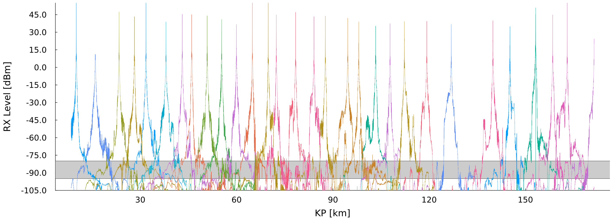
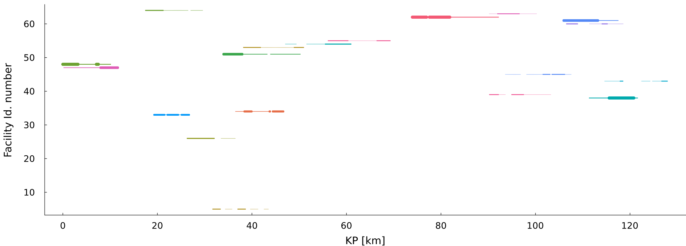

# RailwayOptSitePos

This repository reflects the implementation of an algorithm based on a paper that is set to appear. Please note that the contents of this repository are currently under development and may undergo changes as we refine the implementation to align with the paper. We encourage you to keep an eye on this repository for updates.

## Paper Details

   > Title: Minimizing costs in signal provision from communication antennas along a railway line

   > Authors: [To appear]
<!---
   > Authors: A. Araújo 1, J. O. Cerdeira 2, N. Lopes 3, A. Moura 4

   > 1- CMUC, Department of Mathematics, University of Coimbra;
    2- CMA, Department of Mathematics, NOVA University Lisbon;
    3- ISEL, Polytechnic of Lisboa, and CEMAT, University of Lisboa;
    4- ISEP-LEMA, Polytechnic of Porto, and CMUP, University of Porto;
--->
   > Journal: [To appear]

   > Publication Date: [To appear]

   > Abstract: [To appear]

# Description

The code in this repository aims to replicate the algorithm described in the forthcoming paper. Our intention is to provide a practical implementation that can be used and tested by the community. As such, please consider this code as a work in progress, subject to further modifications and improvements.


# Installation

## Julia and DrWatson
This code base is using the [Julia Language](https://julialang.org/) and
[DrWatson](https://juliadynamics.github.io/DrWatson.jl/stable/)
to make a reproducible scientific project named
> RailwayOptSitePos

To (locally) reproduce this project, do the following:

0. Download this code base. Notice that raw data are typically not included in the
   git-history and may need to be downloaded independently.
1. Open a Julia console and do:
   ```
   julia> using Pkg
   julia> Pkg.add("DrWatson") # install globally, for using `quickactivate`
   julia> Pkg.activate("path/to/this/project")
   julia> Pkg.instantiate()
   ```

This will install all necessary packages for you to be able to run the scripts and
everything should work out of the box, including correctly finding local paths.

You may notice that most scripts start with the commands:
```julia
using DrWatson
@quickactivate "RailwayOptSitePos"
```
which auto-activate the project and enable local path handling from DrWatson.

# USAGE

##  Real Data (see Section 3.1 of the paper):

### Running the Model

To run the model, follow the steps below:

0. Open a console or terminal at the project directory.

1. Run the following command:
   ```
   $julia scripts/model_solvit.jl
   ```
      >   This command executes instance 5 of the model with $LMAX^n=16.2$ and $LMIN^g=138.5$ (see Table 2 of the paper for more details).

* Note: The previous command can be replaced by the usage of an IDE such as VSCode or by running the script in the Julia REPL.

### Output

After running the model, you can expect the following output:

+ A summary of the results and log information displayed at the terminal or console.

+ Graphs representing the signal coverage of all facilities and the  signal coverage provided by the optimal solutions saved in the plots directory.

   Example: Signal coverage of the facility selection

   

     


+ A CSV file reflecting the optimal facility selection  saved at  data/sims directory.

+ An incremental table  with the summary of the optimal solutions saved at data/exp_pro/table.txt and data/exp_pro/raw_table.csv.


## Simulated Data (see Section 3.2 of the paper):

Follow the steps of the Real Data replacing the command in 1. by :
```
$julia scripts/model_sim.jl
```

The output is also similar to the Real Data case:

Example: Signal coverage of the facility selection
   


# Contributing

We welcome contributions to this project! If you find any issues or have suggestions for improvements, please feel free to open an issue or submit a pull request. We appreciate your involvement in making this implementation more robust and accurate.

# License

This project is currently under MIT license. Please refer to the LICENSE file for more information.

# Contact

If you have any questions or inquiries regarding this codebase or the associated paper, please contact: [To appear]
<!---
nuno(dot)lopes(at)isel(dot)pt.
--->